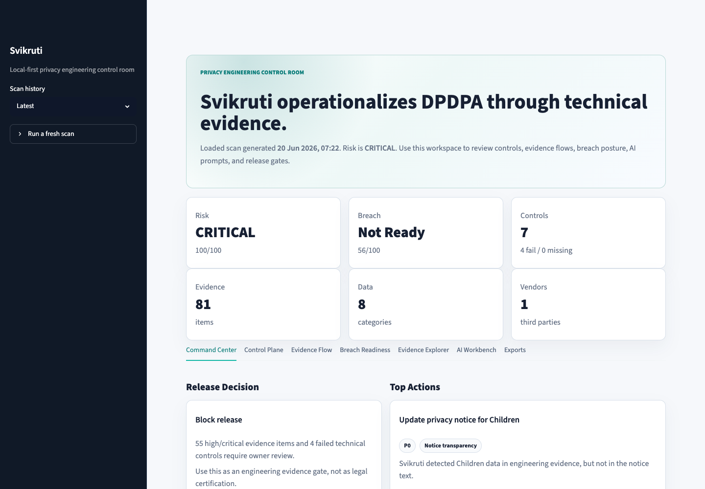
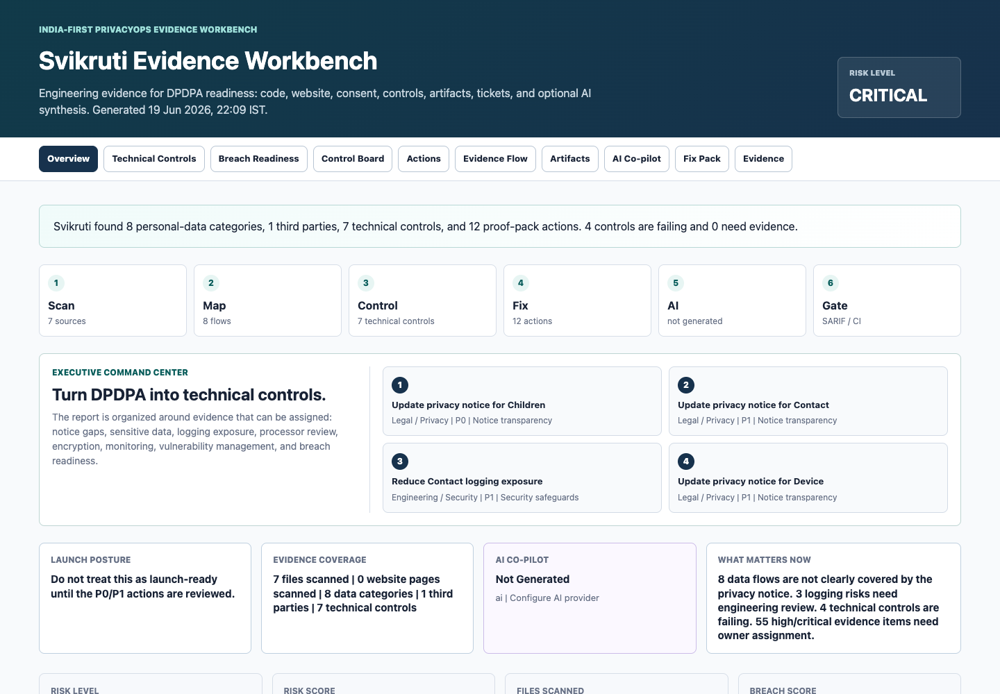
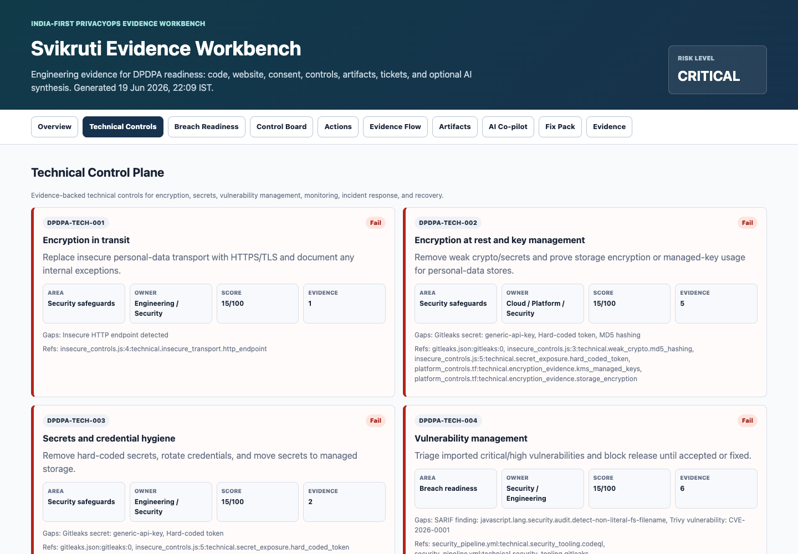
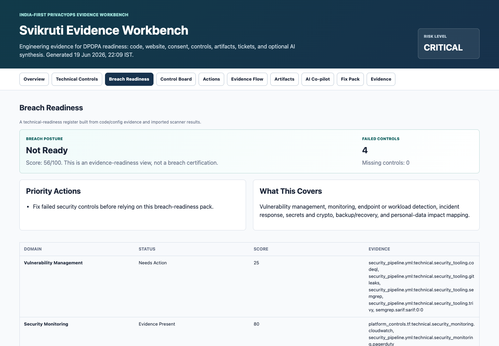
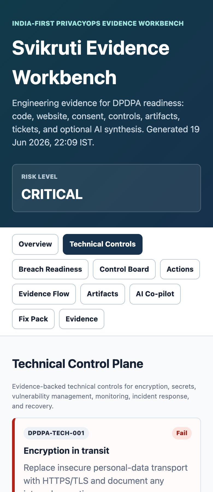

# Svikruti

India-first open-source privacy engineering workbench for DPDPA readiness,
engineering evidence, technical safeguards, consent governance, breach
readiness, and review artifacts.

[](https://www.python.org/)
[](LICENSE)
[](https://www.meity.gov.in/)
[](#ai-co-pilot)

**Project page:** [chevauxenbois.com/projects/svikruti](https://chevauxenbois.com/projects/svikruti/)  
**Launch site:** [chevauxenbois.github.io/svikruti](https://chevauxenbois.github.io/svikruti/)

Svikruti helps teams answer one practical question:

> What personal data does this product appear to process, where is the evidence,
> what is missing from the privacy posture, and what should we fix before
> launch?

Svikruti combines three workflows that are usually separate:

1. **Governance workbench**: a Streamlit app for gap assessment, RoPA, consent,
   rights requests, vendors, breach response, document generation, and DPDPA
   knowledge management.
2. **Privacy engineering control room**: a scanner-native dashboard launched
   with `svikruti dashboard`, backed by a local SQLite evidence database for
   scan history, assurance posture, technical controls, breach readiness,
   evidence flows, and AI workbench prompts.
3. **Evidence scanner**: a developer-first CLI that scans code, websites,
   privacy notices, consent journeys, and security scanner outputs, then
   produces HTML, SARIF, CSV, Markdown, JSON, local history, and optional AI
   commentary.

Most privacy tools start with questionnaires, screenshots, and manual evidence
uploads. Svikruti starts with technical evidence: code, websites, CI security
outputs, encryption signals, logging risks, vendors, consent journeys, and
breach-readiness controls. The goal is simple: make DPDPA implementation
visible in engineering systems, not just in policy documents.

## Launch Demo

- **Sample HTML report:** [examples/sample-report.html](examples/sample-report.html)
- **Hosted demo report:** [chevauxenbois.github.io/svikruti/demo-report.html](https://chevauxenbois.github.io/svikruti/demo-report.html)
- **Sample JSON report:** [examples/sample-report.json](examples/sample-report.json)
- **Sample SARIF:** [examples/sample-report.sarif](examples/sample-report.sarif)
- **Sample exports:** [RoPA](examples/sample-ropa.csv), [actions](examples/sample-actions.csv),
  [vendors](examples/sample-vendors.csv), [technical controls](examples/sample-controls.csv),
  [breach readiness](examples/sample-breach.md), [fix pack](examples/sample-fix-pack.md)



<details>
<summary>More screenshots</summary>









</details>

## Try It In 3 Minutes

Use the source install while the project is moving quickly:

```bash
git clone https://github.com/chevauxenbois/svikruti.git
cd svikruti
python3 -m venv .venv
source .venv/bin/activate
python -m pip install -e '.[parsers]'
```

Generate a full evidence pack with one flag:

```bash
svikruti scan \
  --repo examples/realistic \
  --privacy-file examples/privacy.html \
  --security-evidence examples/security/trivy.json \
  --evidence-pack svikruti-pack
```

That writes `report.html`, `report.json`, `report.sarif`, RoPA/actions/vendors/
controls CSVs, breach-readiness, notice-patch, and fix-pack Markdown into
`svikruti-pack/`. Explicit individual output flags override the matching pack
file.

Or pick every output path yourself:

```bash
svikruti scan \
  --repo examples/realistic \
  --privacy-file examples/privacy.html \
  --security-evidence examples/security/trivy.json \
  --security-evidence examples/security/gitleaks.json \
  --security-evidence examples/security/semgrep.sarif \
  --out svikruti-demo.html \
  --json-out svikruti-demo.json \
  --sarif-out svikruti-demo.sarif \
  --ropa-out svikruti-ropa.csv \
  --actions-out svikruti-actions.csv \
  --vendors-out svikruti-vendors.csv \
  --controls-out svikruti-controls.csv \
  --breach-out svikruti-breach.md \
  --notice-patch-out svikruti-notice-patch.md \
  --issues-out svikruti-fix-pack.md
```

Or save scan history and open the local dashboard:

```bash
svikruti scan \
  --repo examples/realistic \
  --privacy-file examples/privacy.html \
  --security-evidence examples/security/trivy.json \
  --security-evidence examples/security/gitleaks.json \
  --security-evidence examples/security/semgrep.sarif \
  --save-history

svikruti dashboard
```

## One Command, One Evidence Pack

The base scanner uses Python AST plus validated pattern heuristics. Install the
optional parser pack to add a tree-sitter AST backend for JS/TS, Java, Go,
Ruby, and PHP (the language pack may download grammars on first use, so
pre-provision the environment for offline or air-gapped CI runs):

```bash
python -m pip install -e '.[parsers]'
```

```bash
svikruti scan \
  --repo . \
  --url https://example.com \
  --privacy-url https://example.com/privacy \
  --out svikruti-report.html \
  --json-out svikruti-report.json \
  --sarif-out svikruti.sarif \
  --ropa-out ropa.csv \
  --actions-out actions.csv \
  --vendors-out vendors.csv \
  --controls-out technical-controls.csv \
  --breach-out breach-readiness.md \
  --notice-patch-out notice-patch.md \
  --issues-out fix-pack.md
```

Prefer one flag? `--evidence-pack DIR` writes the same artifact set into `DIR`
with default names; explicit individual flags override the matching pack file.

Save scan history and open the interactive dashboard:

```bash
svikruti scan \
  --repo . \
  --privacy-url https://example.com/privacy \
  --security-evidence semgrep.sarif \
  --security-evidence trivy.json \
  --save-history

svikruti dashboard
```

Open a generated JSON report directly:

```bash
svikruti dashboard --report svikruti-report.json --port 8501
```

Import security evidence from existing tools:

```bash
svikruti scan \
  --repo . \
  --security-evidence semgrep.sarif \
  --security-evidence trivy.json \
  --security-evidence gitleaks.json \
  --controls-out technical-controls.csv \
  --breach-out breach-readiness.md \
  --out svikruti-report.html
```

That single command can generate:

| Output | Who uses it | Why it matters |
| --- | --- | --- |
| HTML Evidence Workbench | Founder, privacy, security, engineering | Human review surface with risk, controls, evidence, actions, and flows |
| Interactive Dashboard | Engineering, security, privacy, leadership | Local control room with scan history, filters, charts, evidence flow map, breach posture, and AI workbench |
| SQLite evidence DB | Local/self-hosted product | Persistent scan history for trend, diff, and future hosted workflows |
| JSON report | Product/API/hosted platform | Complete structured evidence for future dashboards or scan history |
| SARIF | Developers/security | GitHub code scanning annotations and PR gates |
| RoPA/privacy inventory CSV | Privacy/legal/GRC | Draft processing inventory with evidence references and fields to confirm |
| Action CSV | Program manager/GRC | Owner-ready remediation tracker |
| Vendor CSV | Procurement/legal/security | Processor register starter with DPA, transfer, and review fields |
| Technical Controls CSV | Security/privacy engineering | Encryption, secrets, vulnerability, monitoring, incident, and recovery control register |
| Breach Readiness Markdown | Security/legal/privacy | Evidence-backed readiness pack for vulnerability management, monitoring, endpoint/workload detection, incident response, and impact mapping |
| Notice patch Markdown | Privacy/legal | Drafting aid for missing notice language |
| Fix pack Markdown | Engineering | Copy-ready GitHub/Jira/Linear tickets |
| AI brief Markdown | Leadership/privacy | Optional AI-assisted synthesis grounded in scan evidence |

## Why This Is Different

Svikruti is not another static compliance checklist.

- **India-first**: built around DPDPA concepts, Indian privacy operations, and
  India-relevant vendors such as Razorpay, Cashfree, Juspay, PayU, PhonePe,
  Exotel, MSG91, Shiprocket, Delhivery, MoEngage, CleverTap, and WebEngage.
- **Evidence-first**: connects files, forms, SDKs, privacy notices, consent
  journeys, and DPDPA control areas.
- **Parser-assisted**: uses Python AST plus structured heuristics for JS/TS,
  Java, Go, Ruby, PHP, SQL, Prisma, GraphQL, OpenAPI, Postman, and Kubernetes
  to identify model fields, request sources, logging sinks, runtime config, and
  storage writes, with scan-quality reporting.
- **Optional tree-sitter backend**: install `svikruti[parsers]` to add
  tree-sitter AST evidence for JS/TS, Java, Go, Ruby, and PHP while keeping the
  base scanner dependency-light. Note: the language pack may download grammars
  on first use, so pre-provision it for offline or supply-chain-sensitive CI.
- **Technical-control native**: treats encryption, key management, secrets,
  vulnerability management, monitoring, endpoint/workload detection, backups,
  and incident response as DPDPA evidence.
- **Production-assurance honest**: separates verified evidence, inferred
  signals, failing controls, and unknowns so Svikruti does not overclaim from
  static scans alone.
- **Cloud/IaC aware**: detects infrastructure guardrails and risky patterns such
  as public storage, public databases, disabled encryption, permissive IAM, and
  wildcard CORS when those signals appear in code or config.
- **Bring your own scanners**: imports SARIF, Trivy, Gitleaks, OSV, and similar
  JSON outputs so security tooling becomes part of privacy readiness.
- **Open-source by default**: useful locally without a hosted account.
- **AI optional**: AI can summarize evidence and draft remediation, but the core
  scanner works without sending data to any model.
- **Launch-ready artifacts**: produces RoPA starters, vendor registers, action
  plans, privacy notice patch drafts, GitHub issues, and SARIF.
- **Local-first product**: `svikruti dashboard` turns scanner output into an
  interactive control room without requiring a hosted account.
- **Board-to-code coverage**: combines executive dashboarding with developer
  pull-request gates.
- **Transparent evidence**: every finding can carry detector ID, confidence,
  source file/line, language, framework hints, and evidence reference.
  JSON reports also include parser coverage and limitations.

## What This Is And Is Not

Svikruti is:

- an open-source privacy engineering workbench for DPDPA readiness review
- a local-first scanner that turns source, web, notice, vendor, and security
  signals into evidence artifacts
- a way to make privacy, security, legal, product, and engineering teams review
  the same evidence
- a starting point for technical controls, release gates, RoPA drafts, vendor
  review, breach readiness, and AI-assisted summaries

Svikruti is not:

- legal advice
- a DPDPA certification
- a replacement for privacy counsel, security review, vendor diligence, or
  production architecture review
- a guarantee that every runtime data flow, vendor, consent path, or
  contractual obligation has been discovered

Use the **Scan Quality** view before making claims from a report. It shows
parser coverage, inspected scope, confidence mix, limitations, and human
verification steps.

## Real-Repository Benchmark

Svikruti's detectors are calibrated against real open-source repositories,
not just its own fixtures. Numbers below are from scanning three well-known
OSS projects (July 2026, default install, no AI):

| Repository | Type | Files | Risk score | CRITICAL+HIGH findings | Manually verified precision |
| --- | --- | --- | --- | --- | --- |
| [excalidraw](https://github.com/excalidraw/excalidraw) | Drawing tool (almost no PII) | 750 | 37 MEDIUM | 6 | 1/6 (all 6 human-reviewed) |
| [healthchecks](https://github.com/healthchecks/healthchecks) | Uptime alerting (real contact data) | 952 | 42 MEDIUM | 141 | ~84% (44 sampled) |
| [saleor](https://github.com/saleor/saleor) | E-commerce platform (heavy PII) | 4,528 | 60 HIGH | 678 | ~80% (41 sampled) |

How to read this:

- A repo with almost no personal data (excalidraw) produces a handful of
  findings, not hundreds - before this calibration pass it produced 221
  CRITICAL/HIGH findings and a 97/100 score; now it produces 6.
- Repos that genuinely process contact, payment, and address data score in
  the MEDIUM/HIGH bands with mostly-true findings (roughly 4 of 5
  CRITICAL/HIGH findings on healthchecks and saleor point at real
  personal-data flows or security-relevant patterns).
- The CRITICAL band is reserved for repos with real critical evidence
  (validated identifiers, live secrets, children-data signals) - volume of
  lower-severity inventory findings can never reach it.

Precision was judged by a manual review pass: every excalidraw finding was
inspected; healthchecks and saleor were randomly sampled (44/141 and 41/678
findings), so the extrapolated figures carry roughly +/-10 points of sampling
error, and borderline categories (weak-crypto and logging-proximity findings)
could swing either way under a stricter or looser rubric. Test/fixture code,
vendored assets, and docs are automatically down-weighted or skipped; the
Scan Quality panel in every report shows exactly what was excluded.

## What It Looks For

Svikruti v1 is built for the messy middle between legal checklists and code
review. It does not claim to prove compliance. It creates a useful evidence
pack that humans can verify quickly.

It currently looks for:

- personal-data categories such as identity, contact, government ID, financial,
  location, children, health, device, and tracking data
- Indian identifier patterns such as PAN (holder-type and context validated),
  Aadhaar numbers (Verhoeff-checksum validated), mobile numbers
  (boundary-safe matching), UPI IDs, and emails
- collection points in forms, request bodies, checkout/signup/profile flows,
  and website fields
- storage points in schemas, models, SQL files, database writes, and ORM hints
- personal data and credentials in `.env` and `.env.*` configuration files
- logging exposure where personal data appears near `console.log`, `logger`,
  `print`, or similar statements
- India-relevant and global vendors, SDKs, scripts, and analytics/payment tools
- privacy notice gaps for detected data categories, vendors, withdrawal,
  grievance, rights, retention, and children-related language
- optional browser consent journey evidence, including tracking before consent,
  reject/accept paths, and withdrawal/preference discoverability
- technical safeguards such as TLS/HTTPS, KMS or managed keys, secret-manager
  usage, password hashing, storage encryption, backup/restore signals, and
  incident-response language
- weak security signals such as hard-coded secrets, weak crypto, insecure HTTP,
  and imported high/critical scanner findings
- vulnerability-management, monitoring, endpoint/workload detection, incident
  response, and recovery evidence for breach-readiness review

The example suite includes Python, HTML, Express/Node, React/TypeScript,
Django-style models, SQL schema, Terraform, CI/security pipeline fixtures, and
imported Trivy/Gitleaks/SARIF results so the scanner is tested against more
than a single toy file.

## What To Expect On A Production Repo

Svikruti is designed to produce useful review evidence, not a magical
compliance certificate. On a real fintech, healthcare, SaaS, ecommerce, or BFSI
codebase, expect it to help with:

- finding likely personal-data fields, request bodies, forms, schemas, and
  logging exposure across supported languages and config files
- mapping evidence to notice gaps, data categories, technical safeguards,
  vendors, RoPA starters, breach-readiness domains, and remediation actions
- importing security scanner output so vulnerability, secret, and container
  findings become part of privacy readiness
- showing confidence, detector IDs, file references, parser coverage, and
  limitations so reviewers can challenge the result

Do not treat a scan as the final legal or security answer. Humans still need to
confirm business purpose, lawful basis/consent posture, contracts, retention,
cross-border transfer position, grievance workflow, incident response maturity,
and whether a detected code signal is truly active in production.

## Review Philosophy

Svikruti separates three things that are often mixed together:

| Field type | Meaning |
| --- | --- |
| Scanner-inferred | The tool observed evidence and made a transparent inference |
| To be confirmed | A human must confirm the business/legal fact, such as DPA status or transfer location |
| Draft recommendation | Suggested wording, action, or control that should be reviewed before use |

That is intentional. A useful privacy tool should not pretend to know your
contracts, retention schedule, or final legal position from source code alone.

## Product Surfaces

### 0. Public Launch Site

The project site is published on GitHub Pages:

```text
https://chevauxenbois.github.io/svikruti/
```

The static source lives under `site/`.

Local preview:

```bash
python3 -m http.server 8765
```

Open `http://127.0.0.1:8765/site/`.

Deployment notes are in [docs/WEBSITE.md](docs/WEBSITE.md).

### 1. Governance Workbench

Run the Streamlit app when you want a business-facing DPDPA workspace.

```bash
python3 -m venv .venv
source .venv/bin/activate
python -m pip install -r requirements.txt
streamlit run app.py
```

The app opens at `http://localhost:8501`.

Core modules:

| Module | What it does |
| --- | --- |
| Dashboard | Compliance score, category posture, readiness metrics, activity overview |
| Gap Assessment | Weighted DPDPA readiness assessment across major compliance categories |
| RoPA Registry | Records of Processing Activities with purposes, data categories, recipients, retention, and safeguards |
| Consent Manager | Consent record tracking, DPDPA consent checklist, children's data handling |
| Privacy Notices | Notice builder with plain-language preview and version-oriented workflow |
| Rights Requests | Data Principal access, correction, erasure, grievance, and nomination request tracker |
| Vendor Management | Processor/vendor inventory, DPA tracking, security posture, risk dashboard |
| Document Generator | Privacy policy, consent notice, DPA, DPIA, RoPA, breach notification, grievance policy |
| Compliance Tracker | Tasks, owners, priorities, deadlines, progress tracking |
| Breach Response | Incident logging, severity classification, notification workflow, timeline |
| Knowledge Base | DPDPA sections, definitions, checklist items, FAQs, and practical guidance |
| Settings | Organization profile, user/org configuration, SDF-related setup |

The knowledge base, assessment config, and document generator are aligned to
the DPDP Act 2023 as enacted (44 sections plus the Schedule of penalties) and
the DPDP Rules 2025. Legal content is a practitioner aid: always verify
section text, penalty amounts, and timelines against the gazetted text and
current rules before relying on them.

AI app modules:

| Module | What it does |
| --- | --- |
| AI Assistant | Conversational DPDPA guidance with section-aware answers |
| AI Doc Drafter | Drafts privacy policies, DPAs, consent notices, breach notices, and RoPA summaries |
| AI Compliance Advisor | Turns assessment gaps into prioritized remediation plans |
| AI Breach Analyzer | Classifies breach scenarios and drafts notification language |
| AI Notice Reviewer | Reviews privacy notices for completeness, readability, and DPDPA fit |
| AI Configuration | Provider, model, API key, and usage configuration |

### 2. Evidence Scanner

Run the CLI when you want developer evidence and a launch/audit pack.

```bash
python -m pip install -e .

svikruti scan \
  --repo examples \
  --privacy-file examples/privacy.html \
  --out examples-report.html \
  --json-out examples-report.json \
  --sarif-out examples-report.sarif \
  --ropa-out examples-ropa.csv \
  --actions-out examples-actions.csv \
  --vendors-out examples-vendors.csv \
  --notice-patch-out examples-notice-patch.md \
  --issues-out examples-fix-pack.md
```

Open `examples-report.html`.

Save the scan to the local evidence database:

```bash
svikruti scan \
  --repo examples/realistic \
  --security-evidence examples/security/trivy.json \
  --security-evidence examples/security/gitleaks.json \
  --security-evidence examples/security/semgrep.sarif \
  --save-history
```

Then launch the scanner-native control room:

```bash
svikruti dashboard
```

The dashboard opens at `http://127.0.0.1:8501` by default.

Dashboard views:

| View | What it does |
| --- | --- |
| Command Center | Release decision, top actions, severity/control posture |
| Assurance | Verified, inferred, failing, and unknown production-readiness dimensions |
| Scan Quality | Parser coverage, inspected scope, confidence mix, limitations, and manual-verification checklist |
| Control Plane | Interactive technical-control cards, filters, evidence refs, AI prompts |
| Evidence Flow | Sankey map and table from source evidence to DPDPA areas and actions |
| Breach Readiness | Vulnerability, monitoring, endpoint/workload, incident, crypto, backup, and impact domains |
| Evidence Explorer | Searchable, severity-filtered evidence table |
| AI Workbench | Evidence-grounded prompts and downloadable AI packet |
| Exports | Download JSON control, breach, and report artifacts |

The HTML output is an offline evidence workbench:

| View | What it shows |
| --- | --- |
| Overview | Launch posture, risk score, scan coverage, severity mix, next actions |
| Scan Quality | What was inspected, what was not proven, parser engines, confidence mix, and how to improve scan quality |
| Assurance Profile | JSON assurance layer showing what was verified, inferred, failing, or unknown |
| Technical Controls | Evidence-backed technical control register for safeguards and breach readiness |
| Breach Readiness | Domain readiness view for vulnerability management, monitoring, endpoint/workload detection, incident response, secrets, backup/recovery, and impact mapping |
| Control Board | Notice, consent, minimization, vendors, RoPA, tracking, logging/security, children-data readiness |
| Actions | Prioritized proof-pack actions with local checkbox state |
| Evidence Flow | Source -> data category -> notice coverage -> DPDPA area -> remediation |
| Artifacts | RoPA starter, export guidance, notice patch, fix-pack copy actions |
| AI Co-pilot | Optional AI-assisted synthesis grounded in scan evidence |
| Fix Pack | Copy-ready GitHub/Jira/Linear implementation tickets |
| Evidence Explorer | Searchable, severity-filtered evidence table |

Scanner inputs:

- repository source code
- public website URL (a single page is fetched and analyzed)
- privacy notice URL or local privacy notice file
- optional browser consent journey through Playwright
- optional SARIF, Trivy, Gitleaks, OSV, or compatible JSON security evidence

Scanner outputs:

- offline HTML evidence dashboard
- structured JSON report
- SARIF for GitHub code scanning
- schema-versioned RoPA / privacy inventory CSV
- schema-versioned remediation action CSV
- schema-versioned vendor / processor register CSV
- schema-versioned technical controls CSV
- breach-readiness Markdown pack
- privacy notice patch Markdown
- GitHub/Jira/Linear-ready fix-pack Markdown
- optional AI brief Markdown
- local SQLite scan history through `--save-history`

CSV schemas are documented in [docs/OUTPUT_SCHEMAS.md](docs/OUTPUT_SCHEMAS.md).
Each row includes evidence references and separates scanner-inferred fields
from fields that privacy, legal, procurement, or engineering must confirm.

## AI Co-pilot

AI is opt-in. The CLI does not call an AI provider unless `--ai` is passed.
The scanner sends a compact, redacted evidence packet, not full repository
files, and evidence strings are marked as untrusted data in the prompt. The
default provider is `gemini` with model `gemini-2.5-flash`; override with
`--ai-provider` and `--ai-model`.

Set the API key for your configured provider in the environment, then run:

```bash
svikruti scan \
  --repo . \
  --privacy-url https://example.com/privacy \
  --ai \
  --out ai-report.html \
  --ai-out ai-brief.md
```

The Streamlit app also includes AI pages for assistant, drafting, compliance
advisor, breach analysis, and notice review.

## Browser Consent Journey

Install optional browser dependencies:

```bash
python -m pip install ".[browser]"
python -m playwright install chromium
```

Then scan:

```bash
svikruti scan \
  --url https://example.com \
  --privacy-url https://example.com/privacy \
  --browser-consent \
  --out consent-report.html
```

Browser mode checks:

- third-party requests before consent
- reject button presence
- tracking after reject
- accept button presence
- withdrawal/preferences discoverability

The browser waits for network idle (6 seconds by default) before evaluating,
and accept-button clicks are only counted when the control appears inside a
consent context.

## GitHub Pull-Request Gate

Generate a workflow:

```bash
svikruti init-github-action
```

The generated workflow can:

- scan the repository on pull requests
- create HTML, JSON, CSV, Markdown, and SARIF artifacts
- upload SARIF to GitHub code scanning
- fail builds above a configured severity threshold

More detail: [docs/GITHUB_ACTION.md](docs/GITHUB_ACTION.md).

## Detection Coverage

Repository scan currently detects signals for:

- identity data
- contact data
- government identifiers
- financial/payment data
- location data
- children-related data
- health data
- device and tracking data
- form collection points
- request body collection points
- database/schema/storage hints
- logging near personal-data terms
- India-relevant and global third-party tools

Website scan fetches a single page (the URL you pass) and currently detects:

- visible form fields
- third-party scripts (classified by script URL host)
- cookies on the first response, including multiple `Set-Cookie` headers
- privacy notice links
- consent copy without obvious withdrawal copy

Privacy notice comparison maps detected data categories and vendors against
notice coverage to identify gaps such as "Location data detected but not clearly
disclosed."

### Detection Quality

Recent accuracy work makes findings harder to fake and easier to trust:

- Aadhaar candidates must pass Verhoeff checksum validation and start with a
  digit 2-9; random 12-digit numbers no longer match.
- PAN detection validates the holder-type character and requires supporting
  context; standalone lookalike tokens are ignored.
- Indian mobile numbers are matched with strict boundaries so digits inside
  longer numbers, IDs, or hashes do not trigger findings.
- Ambiguous standalone terms (for example `state`, `ip`, `zip`, `pan` on their
  own) are no longer treated as personal-data evidence.
- Children-data and health-data findings need corroborating evidence before
  they can escalate a scan to CRITICAL.
- Heuristic parser engines report `medium` confidence; only Python AST
  evidence is reported as `high`.
- The risk score is severity-tiered and bounded: each severity level saturates
  independently, so volume of MEDIUM/LOW inventory findings can never push a
  repository into the CRITICAL band - only real critical evidence can
  and cross-layer deduplication, and excludes positive (passing) evidence.
  Bands: LOW 0-24, MEDIUM 25-49, HIGH 50-74, CRITICAL 75-100.

## Project Structure

```text
svikruti/
  app.py                  # Streamlit governance workbench and routing
  ai_engine.py            # Streamlit app AI provider layer
  ai_pages.py             # App AI assistant, drafting, advisor, breach, notice review
  new_pages.py            # RoPA, consent, notices, rights, vendors
  database.py             # SQLite persistence for app workflows
  doc_generator.py        # DPDPA document generation
  knowledge_base.py       # DPDPA knowledge base content
  config.py               # Categories, questions, templates, settings

  src/svikruti/
    ai.py                 # CLI AI evidence synthesis
    cli.py                # `svikruti` command line entry point
    dashboard.py          # scanner-native interactive control room
    models.py             # report/evidence dataclasses
    store.py              # local SQLite scan history
    scanner/
      code.py             # static repository scanner
      website.py          # public website scanner
      browser.py          # optional Playwright consent journey scanner
      dpdpa.py            # DPDPA aggregation and RoPA starter
      patterns.py         # transparent rules and dictionaries
      technical.py        # technical controls, security evidence import, breach readiness
      runner.py           # scan orchestration
    reports/
      html.py             # offline evidence workbench renderer
      exports.py          # CSV/Markdown exports
      json_report.py      # JSON report
      sarif.py            # GitHub code scanning output

  examples/               # sample app/site/privacy notice and generated report
  tests/                  # scanner tests
  docs/                   # launch, GitHub Action docs, and screenshots
```

## Free And Enterprise Model

Open-source/free:

- local Streamlit governance workbench
- local evidence scanner
- local scanner-native dashboard
- local SQLite scan history
- DPDPA knowledge base
- document generation
- BYOK AI flows
- GitHub Action
- HTML/JSON/SARIF/CSV/Markdown exports
- technical-control register and breach-readiness pack
- security scanner evidence import

Enterprise/hosted direction:

- managed scan history and evidence vault
- org dashboards across many products
- hosted AI with provider management
- continuous technical-control posture across repositories, cloud config, CI,
  and security tools
- Jira/Linear integrations
- vendor evidence collection workflows
- SSO, RBAC, audit logs, and policy approvals
- sector packs for BFSI, healthcare, education, SaaS, ecommerce, and fintech
- continuous privacy posture monitoring

## Security And Privacy

- Static scanner mode does not execute customer source code.
- CLI scan runs locally by default.
- AI is disabled unless explicitly enabled.
- AI requests are compact evidence packets, not full repositories. The packet
  is redacted before sending, and evidence strings are marked as untrusted
  data in the prompt.
- Messages imported from external scanners (SARIF, Trivy, Gitleaks, OSV) are
  truncated, and secret values from secret-scanner runs are redacted before
  they reach reports.
- CSV exports are guarded against spreadsheet formula injection.
- Reports may contain file paths, line numbers, inferred data categories, and
  vendor names; review before sharing externally.
- The optional `parsers` extra (tree-sitter language pack) may download
  grammars on first use; pre-provision it for offline or
  supply-chain-sensitive environments.
- Svikruti is an evidence and workflow tool, not legal advice or compliance
  certification.

## Launch Plan

See [docs/LAUNCH_PLAN.md](docs/LAUNCH_PLAN.md) for the initial launch motion,
positioning, free tier, enterprise tier, and follow-up roadmap.

Suggested launch wedge:

> Open-source PrivacyOps for India: scan your product, map engineering evidence
> to DPDPA readiness, and generate the first audit pack in minutes.

## Roadmap

See [ROADMAP.md](ROADMAP.md) for the launch roadmap and contribution areas.

- richer privacy notice semantic comparison
- full secret and sensitive value redaction before report generation
  (partially done: imported secret-scanner runs are already redacted and
  imported messages truncated)
- authenticated app scanning
- deeper framework-specific code analysis
- hosted evidence vault
- consent receipt verification
- DSR workflow automation
- richer breach workflow automation with monitoring, vuln management, and
  incident-response evidence ingestion
- Jira/Linear ticket sync
- Hindi and Indian language notice support
- sector-specific DPDPA packs

## Contributing

Useful contributions:

- new detection patterns
- additional India-specific vendors and SDKs
- tests for common web frameworks
- privacy notice examples
- DPDPA document templates
- language translations
- UI improvements
- deployment recipes

## License

MIT License. Free for personal and commercial use.

## Author

Harsh Kahate

Information Security and Data Privacy Professional

- LinkedIn: [hkahate](https://linkedin.com/in/hkahate)
- Blog: [chevauxenbois.com](https://chevauxenbois.com)

Svikruti is built to make DPDPA readiness practical for Indian startups,
security teams, privacy teams, product teams, and engineering teams.
